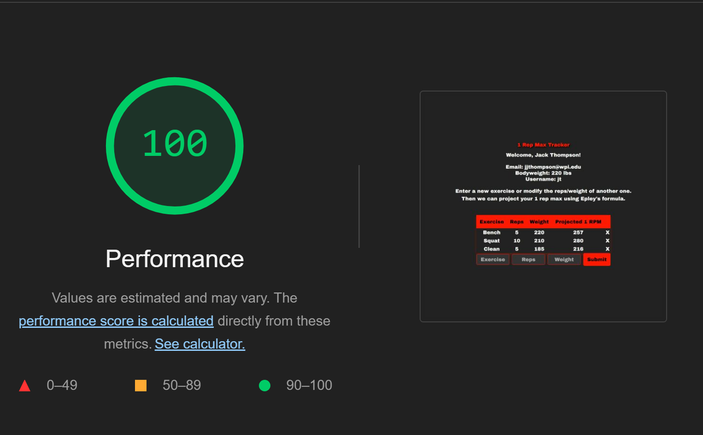

# 1 Rep Max Calcuator

Find it here: https://a3-jack-thompson101.vercel.app/

I created a single page app that allows the user to add data about their lifts and then calculates their projected max(the derived data). The styling is simple, displaying a tablke in the middle of the screeen with a short description of how to use the app. I replaced my css with material tailwind to fit the requirement for this assignment, I have used it in the past, but I am rusty, I wanted to get some practice converting my css to tailwind. For authentication I just check it unencypted against the database, it hurt my integrity, but it was the easiest. The only real challenge I had was changing my password in atlas so I could leave it in the server code. It really wasn't hard but it took me forever.... 

**TO LOGIN USE:**

Username: jt

Password: test

## Technical Achievements

### Technical Achievement 1

Deployed to Vercel. It was fine, I did have to fix somethings. The first was adding my vercel config file `vercel.json` this worked, but I had to play with it for a while. The other problem I had was the it was losing my mongodb session so I had to include mongo connect to maintain it, and it is another middleware package for credit. The only downside I have with Vercel is it is more expensive so if I was actually launching a webapp I would probably use AWS.

### Technical Achievement 2

`express-session` - used for session management

`mongo-connect` - implemented after vercel deployment wasn't working. Used to maintain the mongo session.

### Technical Achievement 3

100% in lighthouse running all 4 tests



## Design/Evaluation Achievements

### Design Achievement 1

#### Writing:

Provide informative, unique page titles

- Login page has title: `Login Page`
- Home page has title: `1 Rep Max Tracker`

Provide clear instructions

- I include the following on the home page:
  - ```
    Enter a new exercise or modify the reps/weight of another one.
    Then we can project your 1 rep max using Epley's formula.
    ```

Use headings to convey meaning and structure

- I use proper headings in the home page for example, I have `h1` for the title, `h2` for the users name and  `p` for other user info as it is less important

Write meaningful text alternatives for images

- I did this for the home page barbell image
  - `<imgsrc="https://pngimg.com/uploads/barbell/barbell_PNG16360.png"class="w-20"alt="Barbell Image">`

#### Design

Provide sufficient contrast between foreground and background

- I did this by giving the dark gray background with white text to make it easy to read and the red on gray was clean but also popped

Use headings and spacing to group related content

- I used `header` tags to section off pieces on the home page. I also used 

Create designs for different viewport sizes

- My styling does this inheriantly by using view width and height instead of px

Don’t use color alone to convey information

- There is no where on my sight where it is only color that displays information.
  - This means that there shuold not be any probelms for colorblind users

#### Development

Reflect the reading order in the code order

- This is consistant in my code. You can read vertically down the html code and the webpage and they will be the same

Identify page language and language changes

- I did this with the line at the top of both login and home pages
  - `<html lang="en">`

Associate a label with every form control 

- I hope this counts, I did not add labels because I don't think it looks good, instead I added placeholders. This hits the same goal and looks cleaner in the design

Write code that adapts to the user’s technology

- I included the code below as a way max the font bigger and the dataForm to fit on mobile applications. I used `25em` as that is what was stated in the w3c docs

  ```css
  @media screen and (max-width: 25em) {
      body {
        font-size: 200%;
      }

      h1, h2, p, th, td, input, button {
        font-size: 200%;
      }
      #dataForm{
          width: 100%;
      }
    }
  ```
